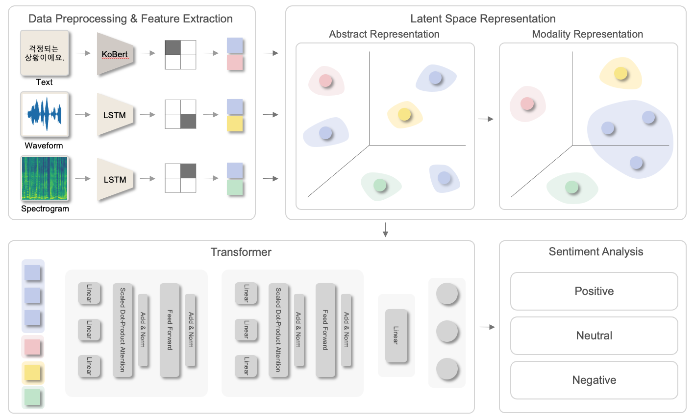

# Sentiment analysis using a multi-modal deep learning approach in Korean speech and sentence

#### We propose a multi-modal deep learning approach that can recognize not only Korean text but also speech. We projected the spectrogram and waveform of the Korean voice and the embedding vector of the script sentence into one multi-modal representation.
###
#### To design our model, we referred to two papers written by [D. Hazarika et al.](https://dl.acm.org/doi/pdf/10.1145/3394171.3413678) 

## Dataset 
#### For the experiment, we experimented with the proposed method using a speech synthesis dataset for emotion analysis provided by AI Hub.
